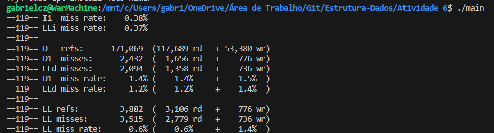
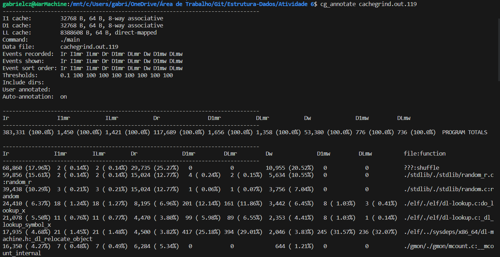
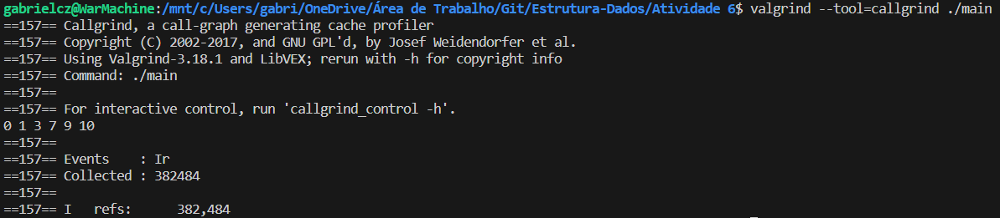
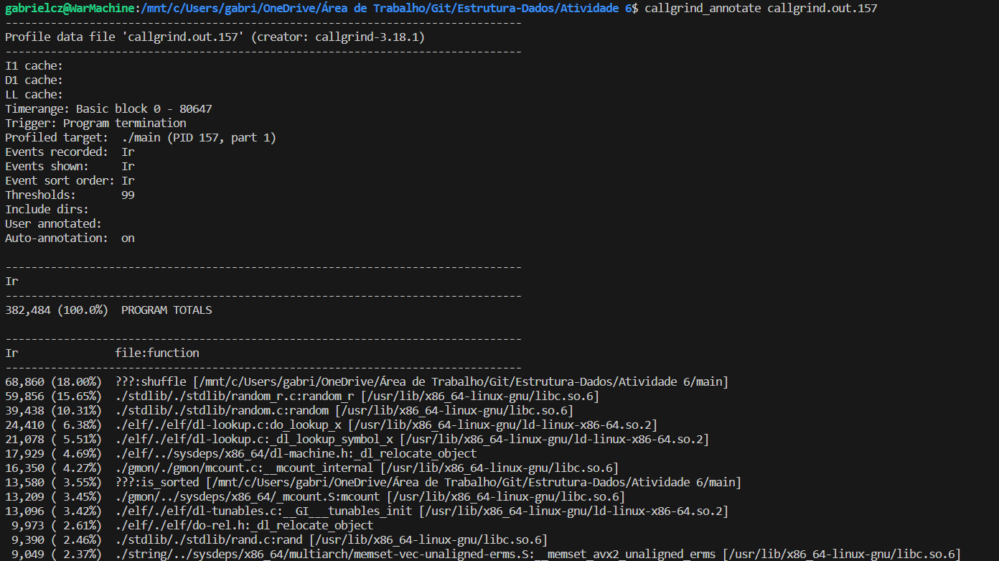

**Alunos:** 
- Gabriel Camatta Zanotelli - 2018020140
- Amanda Guimarães Caixeta Silva - 2018020360

---
### **1. Avalie qualitativamente o programa a ser caracterizado em termos dos acessos de memória esperados e localidade de referência. Identifique as estruturas de dados e segmentos de código críticos (p.ex., mais custosos)**

O algorítmo em análise é o método de ordenação *Bogosort* (também conhecido como *Estou com Sort*), conhecido por sua ineficiência e falta de utilidade prática, por ser um algoritmo de ordenação aleatório que, na média, requer `O(n!)` iterações para ordenar uma lista de n elementos.

Apenas por esse fata já podemos afirmar que o algorítmo terá diversos acessos aleatórios de memória, podendo resultar em inúmeras falhas de cache e uma baixa localidade de referência. Adicionalmente, devido a sua natureza previamente citada, o loop de análise da ordenação será executado muitas vezes, acarretando em um extenso tempo de execução.

---
### **2. Elabore o plano de caracterização de localidade de referência, nesse momento indicando as execuções e ferramentas a serem realizadas e porque.**

---
### **3. Selecione os parâmetros do programa a ser caracterizado**

- Programa não deve executar por muito ou pouco tempo, mas o suficiente para entender o comportamento do algoritmo.

---
### **4. Execute o código com Cachegrind:**

- valgrind --tool=cachegrind <binário do programa> <parâmetros>

- cg_annotate cachegrind.out.<número do processo do passo 1>

---
### **5. Execute o código com Callgrind**

- valgrind --tool=callgrind <binário do programa> <parâmetros>

- callgrind_annotate callgrind.out.<número do processo do passo 1>

---
### **6. Avalie as saídas do CacheGrind/CallGrind para responder as seguintes perguntas:**

- **Quão bem o programa se comporta em termos de memória?**

Pelo resultado do *cachegrind*, temos que a execução teve uma *D1 miss rate* de apenas 1,4%, ou seja, o cache de memória foi eficaz em aproximadamente 98,6% da execução do programa.

- **Quais estruturas de dados devem serem caracterizadas para melhor entendimento?**

Para o bogosort, a estrutura de maior importância é a lista onde os dados são armazenados. Dessa forma, para aumentar a eficiência, seria vantajoso a implementação de uma estrutura de dados com uma complexidade linear menor, como uma **Lista encadeada**.

- **Quais segmentos de código devem instrumentados para suportar a caracterização?**

Deve-se instrumentar os segmentos de código de acesso à memória, contando a quantidade e padrões de acesso, usando como métrica de qualidade o tempo e taxa de sucesso dos mesmos. 

Adicionalmente, deve-se rastrear as inserções na lista ordenada, seu número de execuções, seus padrões de inserção e de acesso à memória.

Finalmente, é importante a análise do algorítmo de embaralhamento empregado, medindo quantas vezes é chamado e seu tempo de execução.